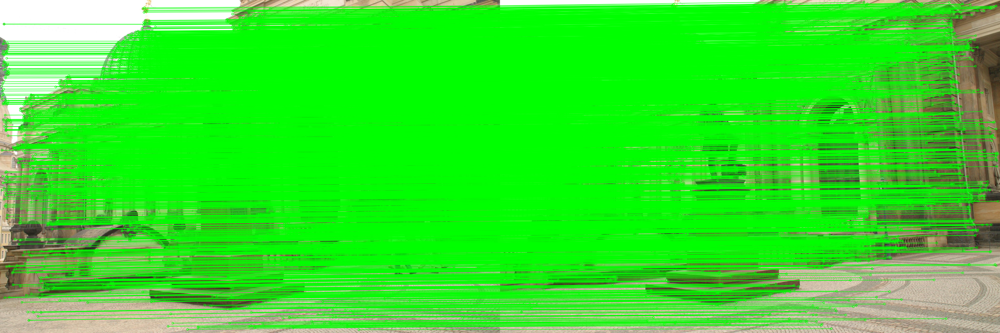

## Structure from Motion

Shiyu Mou

shiyumou@usc.edu


## Results

Note that only the matrices of second camera are shown as the world coordinate is aligned with the first camera. 

#### 0-1: 

```python
Test Ratio: 0.9
R: 
[[ 9.97739563e-01  2.13911874e-03  6.71653870e-02]
 [-8.59177937e-04  9.99817598e-01 -1.90796599e-02]
 [-6.71939495e-02  1.89788245e-02  9.97559410e-01]]
t:
[[-0.97755596]
 [ 0.0382311 ]
 [ 0.20717803]]
Projection Matrix:
 [[ 1.33522862e+03  1.75801346e+01  8.61112256e+02 -1.19943644e+03]
 [-3.48311258e+01  1.39601853e+03  4.72954065e+02  1.56738317e+02]
 [-6.71939495e-02  1.89788245e-02  9.97559410e-01  2.07178030e-01]]
```


Inner match


#### 0-2: 

```python
Test Ratio: 0.8
R: 
[[ 0.9972597   0.00653782  0.07369092]
 [-0.00562026  0.99990417 -0.01265196]
 [-0.07376657  0.01220312  0.99720087]]
t: 
[[-0.99890188]
 [ 0.04277542]
 [ 0.01911292]]
Projection Matrix: 
 [[ 1.32950311e+03  1.84799536e+01  8.69907360e+02 -1.37384869e+03]
 [-4.47241380e+01  1.39274643e+03  4.81688315e+02  6.88882675e+01]
 [-7.37665745e-02  1.22031233e-02  9.97200871e-01  1.91129238e-02]]
```


Inner




#### 1-2: 

```R
Test Ratio: 0.7
R: 
[[ 0.9998798   0.00384662  0.01501975]
 [-0.00393659  0.99997446  0.00596526]
 [-0.01499642 -0.00602367  0.9998694 ]]
t: 
[[-0.99675237]
 [ 0.06185202]
 [-0.05156591]]
Projection Matrix: 
 [[ 1.37837625e+03  7.11161200e-01  7.90403224e+02 -1.42525689e+03]
 [-1.29668858e+01  1.38371894e+03  5.08842079e+02  5.99588197e+01]
 [-1.49964248e-02 -6.02367457e-03  9.99869403e-01 -5.15659128e-02]]
```


Inner


### Analysis 

The method works fine in reconstruction the buildings. From the 3D plot we can discover the 3D structure of buildings, we can even see a lit bit of the sculpture of the horse. 

However, this method is considered "indirect method", which relies on feature matching. Only matched features are reconstructed. This results in sparse reconstruction, we can observe holes everywhere. 

One way to get denser reconstruction is to use direct method, similar to the stereo method we talked about in class. After we get camera pose, we first rectify the camera, then construct points by matching neighbor color intensities for each pixel and compute disparity map. OF course this method may fail in some area like white wall, sky, floor, due to low color intensity gradient, but still we get much denser results. 

Speaking of the accuracy of reconstruction, since we totally have 3 images, we can actually run a global bundle adjustment to optimization R, t and 3D locations. 

​    